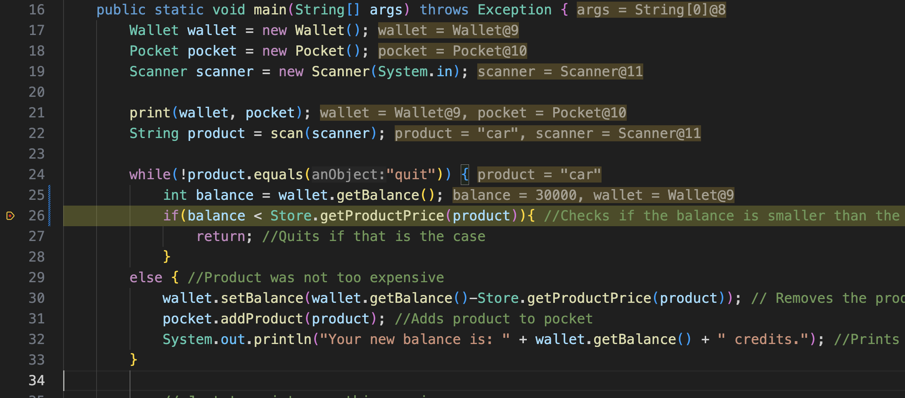
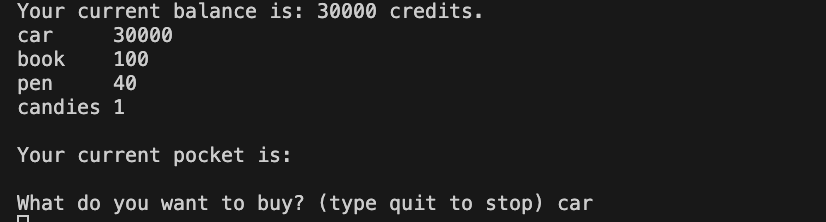
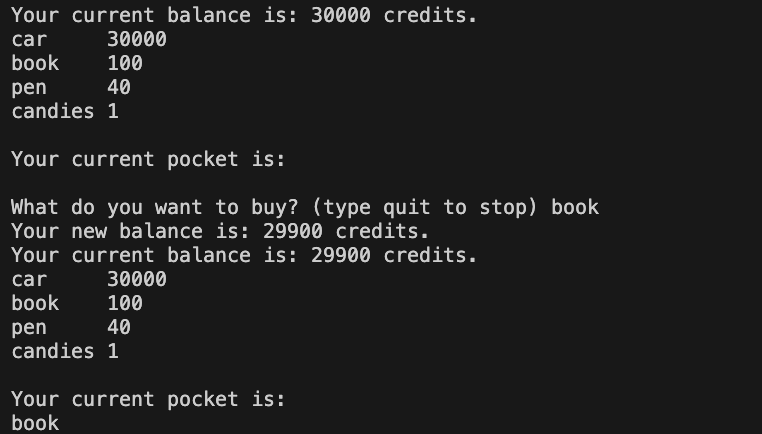
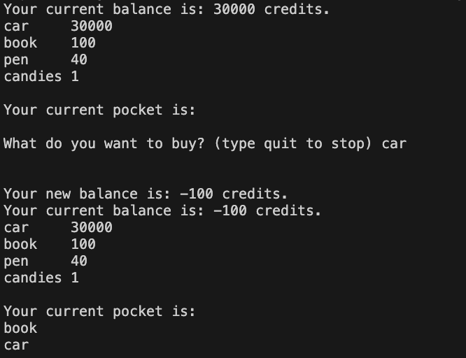

# TOCTOU Lab Report

## Part 1

### **Shared Resource**
The shared resource in this system is `wallet.txt`, which is managed by the `Wallet` class. It stores the user's balance.

### **Who Is Sharing It?**
The main thread of the program (`ShoppingCart.java`) uses this file to read the balance and perform withdrawal operations.  
However, when multiple instances of the frontend are running simultaneously, they all interact with the same `wallet.txt` file, effectively sharing access to this resource during the purchasing process.

---

### **Root Cause of the Problem**
The key issue lies in the separation of two operations:

- **Checking** the balance: `wallet.getBalance()`
- **Modifying** the balance (deduction): `wallet.setBalance(...)`

These two actions are performed separately. The time gap between them creates a **race condition window**.  
If another thread or process modifies the wallet during this window, the balance check becomes outdated, potentially allowing unauthorized purchases.

---

##  How to Exploit the System (TOCTOU Attack)

This vulnerability can be exploited by simulating a TOCTOU attack using multiple concurrent frontend instances (here we use two instances):

### Step 1: Thread T1
Start the program: `java ShoppingCart`. Choose a product, e.g., **Car**, which costs `30000`, equal to the current wallet balance. Pause the execution before the program deducts the balance (using a debugger)

### Step 2: Thread T2
Start another instance of java ShoppingCart. Choose a cheaper product (≤ 30000). Since T1 hasn’t updated the wallet yet, the balance is still seen as 30000. T2 successfully purchases the item and modifies the wallet.

### Step 3: Resume T1
T1 continues and completes the withdrawal of 30000. The system has now overdrawn the wallet.
